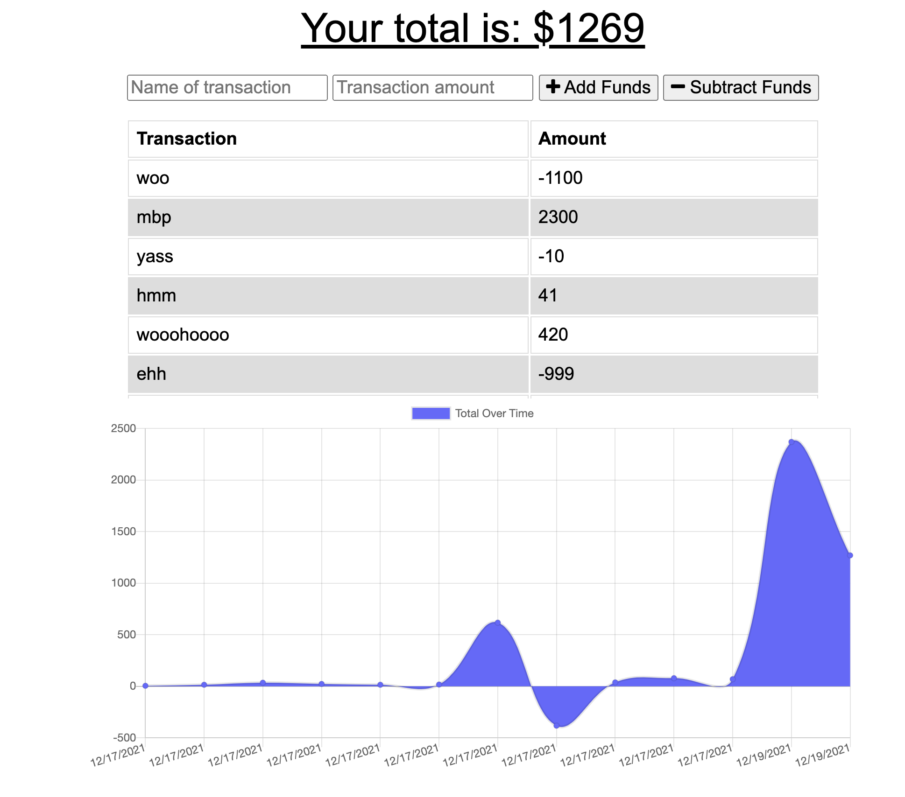

    
    
    
    
    
    

# Budget Tracker 📈

Budget Tracker is a lightweight MongoDB-powered website to see a graph on how you're spending, or making money.

## Quirks 🎯

The website will load the transactions regardless of internet connection.

If the website goes offline and a transaction is input, it'll upload it to the server once connection is restored.

## Preview 👀

[Netlify Link](https://budget-tracker28282.netlify.app/)

## License 📓

[MIT](https://choosealicense.com/licenses/mit/)
